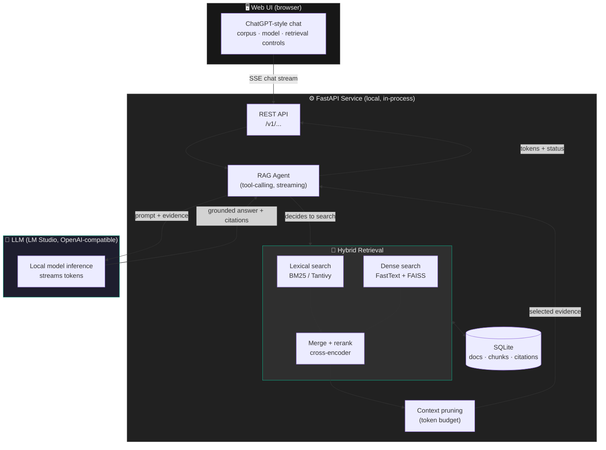
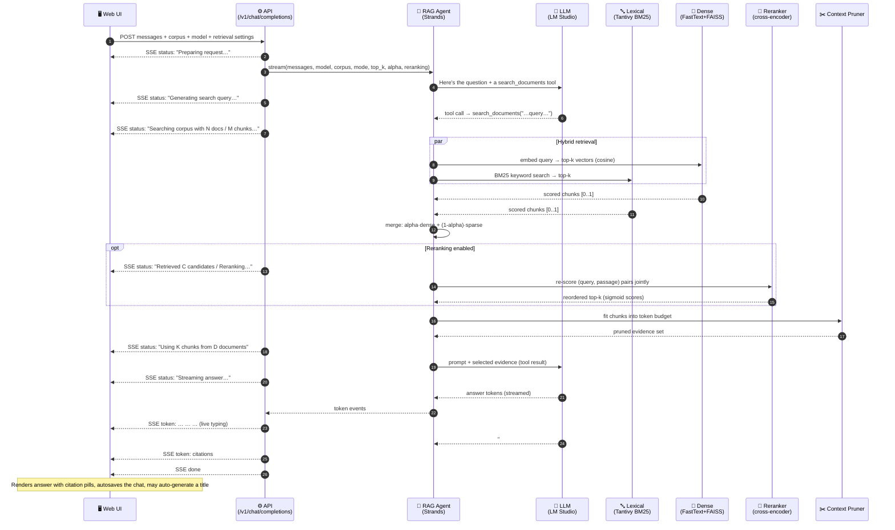
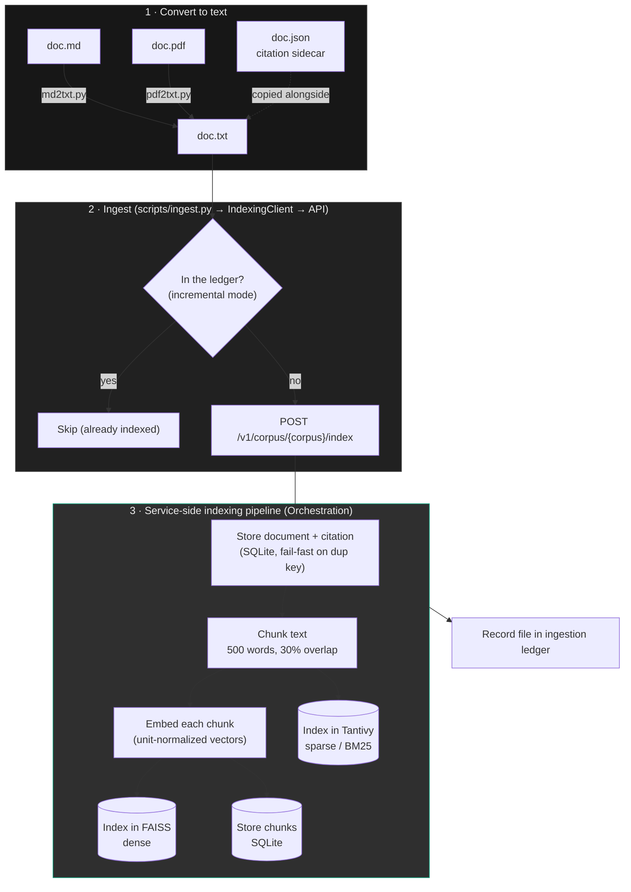
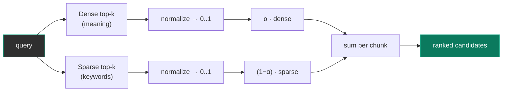
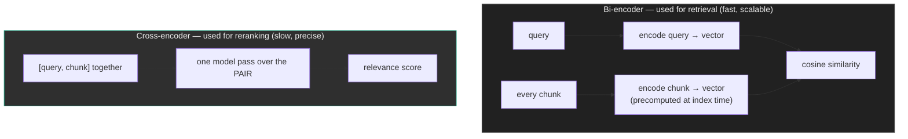
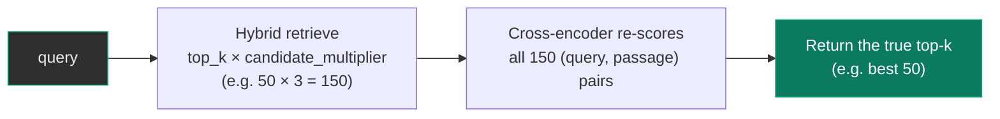
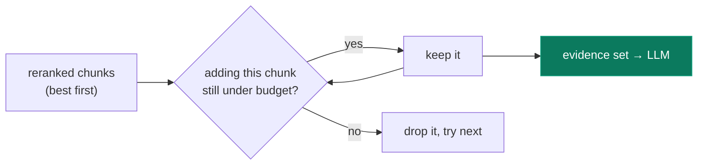
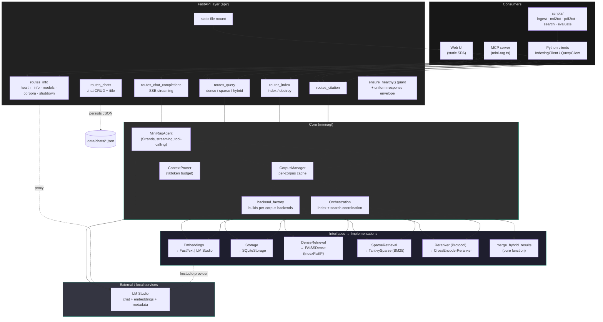
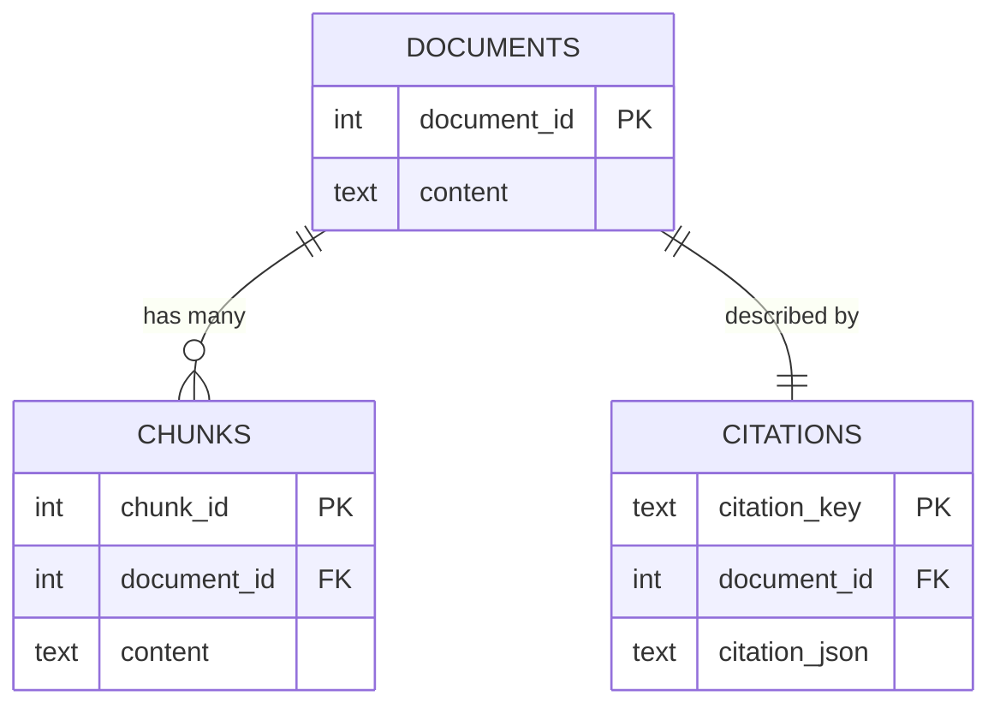

# MiniRAG — Talk to Your Own Documents, Locally

> A local-first RAG (Retrieval-Augmented Generation) system: index your own
> `.md`, `.txt`, and `.pdf` documents, then **chat** with them. The assistant
> searches your corpus, reads only the most relevant passages, and writes a
> grounded answer **with inline citations** — all on your machine, with no cloud
> services and nothing leaving your laptop.

  

---

## 1. The one-sentence pitch

**MiniRAG turns a folder of documents into a chat partner that answers from
*your* material and shows you exactly where every claim came from.**

For a non-technical reader: imagine giving a brilliant assistant a private
library — books on architecture, your meeting notes, a stack of research
papers — and being able to *ask it questions in plain language*. It doesn't
make things up; it finds the relevant pages, reads them, and answers with
footnotes you can verify.

For a technical reader: it's a fully local, configuration-driven hybrid
retrieval engine (BM25 + dense vectors + cross-encoder reranking) wired to a
tool-calling LLM agent, exposed through a FastAPI service, an MCP server, and a
ChatGPT-style web UI.

---

## 2. Why this exists — the problem in one picture

A large language model is smart but has two hard limits:

1. **It doesn't know your private documents.** It was trained on the public web,
   not on your notes, your codebase, or your company's PDFs.
2. **It can't read everything at once.** Even a 10,000-document library will not
   fit into a model's context window.

RAG solves both. Instead of stuffing the whole library into the prompt, we
**search** the library, select only the handful of passages that actually
matter, and hand *those* to the model.


> **The core trick:** MiniRAG searches the *entire* index but places only the
> *selected evidence* into the prompt. Large collections stay usable, answers
> stay grounded, and you can always trace a claim back to its source.

---

## 3. What you can do with it

| Use case | Example |
|----------|---------|
| **Personal knowledge base** | Index books on refactoring, prompting, and system design; ask "What does the literature say about the strangler-fig pattern?" |
| **Research assistant** | Drop in a folder of papers (with citation metadata); get answers with proper `[1] author2026` references. |
| **Notes & docs Q&A** | Point it at your meeting notes or product docs and interrogate them conversationally. |
| **Tooling for AI agents** | Expose your corpus to Claude (or any MCP client) as a `search` tool via the bundled MCP server. |

---

## 4. The 30,000-foot architecture

Five high-level components, each independently swappable:



**Why this shape?** The LLM never talks to the index directly. It is given one
**tool** — `search_documents` — and *decides on its own* when to call it. The
service owns retrieval, scoring, pruning, and citation tracking; the model owns
language and reasoning. Clean separation, each side independently testable and
replaceable.

---

## 5. End-to-end: what happens when you ask a question

This is the full lifecycle of a single chat message, touching every high-level
component: **UI → API → Agent → LLM (query decision) → lexical search → dense
search → reranking → context pruning → LLM inference → UI**.



Every status line in that diagram is a **real event** the service emits over
Server-Sent Events, so the user sees the machine thinking: *generating query →
searching → reranking → pruning → streaming answer*.

---

## 6. The data folder — where everything lives

MiniRAG is **multi-corpus**: each named corpus (e.g. `books`, `notes`) gets its
own isolated storage and indices. Everything derives from one configurable
`data_dir`.

```text
data/
├── input/
│   └── {corpus}/
│       ├── md/            # Markdown source files (human-authored)
│       ├── txt/           # Plain-text, ingestion-ready  ← the index reads from here
│       │   ├── doc.txt
│       │   └── doc.json   # Optional citation sidecar (flat or nested format)
│       ├── metadata/      # Source/citation metadata
│       └── evals/         # Q&A pairs for retrieval-quality evaluation
│
├── models/                # Embedding + reranker model files
│   └── cc.en.300.bin      # FastText, 300-dim Common Crawl English
│
├── storage/
│   └── {corpus}/
│       └── minirag.db     # SQLite: documents, chunks, citations
│
├── index/
│   └── {corpus}/
│       ├── faiss/         # Dense vector index (cosine via inner product)
│       └── tantivy/       # Lexical BM25 index (tokenized, stemmed)
│
├── chats/                 # Persisted conversations as JSON (atomic writes)
│   └── 20260623-..._.json
│
└── export/                # Exported chunks for inspection/debugging
```

**Path discipline:** components only know their own subdirectory convention
(the ingestion module knows `input/{corpus}/txt/`, the embeddings module knows
`models/`). The base `data_dir` is the single source of truth, set in config.

---

## 7. The ingestion pipeline — from raw files to a searchable index



Key properties:

- **Incremental indexing** — a per-corpus *ledger* records what's already
  indexed. `just ingest --update` adds only new files; a full `just ingest`
  destroys and rebuilds. Re-indexing 10,000 documents takes < 10 minutes on a
  modern laptop.
- **Citations are first-class** — every document carries a citation record,
  either from a `.json` sidecar (flat `{cite_key, title, doi, …}` *or* nested
  format — both are normalized) or auto-generated from the filename. Citation
  keys must be unique; duplicates fail fast.
- **Fail-fast, no silent partial state** — if one file fails to index, ingestion
  stops with the original error. Files indexed before the failure stay in the
  ledger, so a re-run resumes cleanly.
- **Deterministic** — files are processed in sorted order for reproducible
  chunk/document IDs.

---

## 8. Dense vs. Sparse retrieval — and why you need both

This is the heart of "hybrid" search. The two methods fail in *opposite* ways,
so combining them is strictly better than either alone.

### Sparse (lexical / BM25 — Tantivy)

Matches **the actual words**. Think of a very smart `Ctrl-F` that understands
word frequency, document length, and stemming.

- ✅ Exact terms, names, codes, rare jargon, acronyms (`K8s`, `BM25`, `useEffect`).
- ✅ Transparent and fast; no model needed.
- ❌ **Vocabulary mismatch:** a search for "car" misses a document that only
  says "automobile." It matches *strings*, not *meaning*.

### Dense (semantic / vector — FastText + FAISS)

Matches **meaning**. Each chunk and the query become a 300-dimensional vector;
similar meanings land near each other in vector space (cosine similarity).

- ✅ Synonyms and paraphrase: "car" ≈ "automobile" ≈ "vehicle."
- ✅ Conceptual questions where the user's words differ from the document's.
- ❌ **Imprecise on exact tokens:** can rank a *thematically* similar passage
   above the one that literally contains the term you typed; may blur rare
   identifiers.

### Side-by-side

| Dimension | Sparse (BM25) | Dense (vectors) |
|-----------|---------------|-----------------|
| Matches on | Exact words / stems | Meaning / semantics |
| Synonyms & paraphrase | ✗ Misses | ✓ Handles |
| Rare terms, IDs, names | ✓ Excellent | ~ Can blur |
| Typo / morphology | ~ Stemming helps | ✓ Robust |
| Interpretability | ✓ "these words matched" | ✗ Opaque geometry |
| Cost | Cheap, no model | Needs an embedding model |
| Classic failure | "car" ≠ "automobile" | ranks vibe over the exact keyword |

### Hybrid = the best of both

MiniRAG runs **both** searches, normalizes each to `[0, 1]`, then blends them
with a single tunable knob **α (alpha)**:

```
final_score = α · dense_score + (1 − α) · sparse_score
```

- `α = 1.0` → pure semantic (meaning only)
- `α = 0.0` → pure lexical (keywords only)
- `α = 0.65` → the shipped default — lean semantic, keep keyword precision



---

## 9. Why a reranker? (The crucial third stage)

Hybrid merge gives a *good* ordering, but dense and sparse scores were computed
**independently of each other** and then arithmetically combined. Neither stage
ever looked at the query and a passage *together*. That's exactly what a
cross-encoder reranker does.

### Bi-encoder vs. cross-encoder



- A **bi-encoder** (retrieval) embeds the query and each chunk *separately*.
  This is what makes search fast — chunk vectors are precomputed once and stored
  in FAISS — but the query and chunk never "meet," so subtle relevance is lost.
- A **cross-encoder** (reranker) feeds the query and a candidate passage through
  the model **together**, letting every query word attend to every passage word.
  Far more accurate, but far too slow to run over the whole corpus.

### The pattern: retrieve wide, rerank narrow



MiniRAG retrieves a **wide** candidate pool (`top_k × candidate_multiplier`,
default ×3) cheaply with the bi-encoder + BM25, then spends the expensive
cross-encoder pass only on those finalists. Raw logits are squashed to `[0, 1]`
with a sigmoid and the list is re-sorted.

> **Why it matters for the answer:** the reranker decides *which* passages reach
> the LLM. Better finalists → a better-grounded, more accurate answer with the
> right citations. The model is only ever as good as the evidence you hand it.

Reranking is **opt-in** via config (`search.reranking.enabled`); the chat UI
also exposes a per-conversation toggle. Default model:
`cross-encoder/ms-marco-MiniLM-L12-v2`.

---

## 10. Context pruning — fitting evidence into the model's head

Even after reranking, the selected chunks must fit inside the model's context
window alongside the system prompt and the answer. MiniRAG counts tokens
(`tiktoken`, `cl100k_base`) and keeps the highest-ranked chunks that fit within
a **document-token budget** = `context_window × document_context_fraction`
(default 60% of the window).

- The model's true context window is discovered live from **LM Studio's metadata
  API** (`/api/v1/models`, with a `/api/v0` fallback), cached per model.
- If LM Studio metadata is unavailable, it falls back to a conservative 4096-token
  window.
- The UI reports pruning when it happens: *"Pruned context to K chunks within
  N document tokens."*



---

## 11. The LLM layer — a tool-calling agent

The conversational agent is built on the **Strands Agents SDK** talking to a
**local LM Studio** server over its OpenAI-compatible API
(`http://127.0.0.1:1234/v1`). This means **any** model you load in LM Studio
works — the model id is passed through verbatim.

How it behaves:

- The agent is given the `search_documents` tool and a system prompt instructing
  it to **always ground claims in retrieved data** and to **cite sources**.
- It autonomously decides when to search (it can search, read, and even refine).
- Tool results are formatted as `[citation_key#chunkN] passage text` so the
  model can map evidence back to sources.
- The model emits a final **`#### Sources`** section mapping `[1]`, `[2]`… to
  source document keys — and is explicitly forbidden from inventing keys.
- Responses **stream token-by-token** back to the browser; the stream is fully
  **cancellable** (closing the request stops model inference mid-flight).
- A separate lightweight **title agent** generates a ≤5-word chat title from the
  first exchange.

---

## 12. Detailed system diagram (low level)

Every module, the interface it implements, and its concrete backend. **All
backends are swappable** because everything is programmed against an interface.



### Storage schema (SQLite, per corpus)



Retrieval engines return `(chunk_id, score)`; the orchestration layer resolves
each chunk back to its text and citation key through SQLite (with a thread-safe
LRU cache for citation-key lookups), producing the uniform `SearchResult` type
used everywhere — retrieval, merge, rerank, clients, and API serialization.

---

## 13. The REST API at a glance

All endpoints are versioned under `/v1`, return a uniform envelope
(`{status, data}` or `{status, error}`), and are guarded by a health check.

| Method & path | Purpose |
|---------------|---------|
| `POST /v1/chat/completions` | **The chat endpoint** — streams a grounded answer over SSE (`status`/`token`/`error`/`done`). |
| `GET/POST/PUT/DELETE /v1/chats[/{id}]` | Chat persistence (list, create, load, update, delete). |
| `POST /v1/chats/{id}/generate-title` | Auto-name a conversation. |
| `GET /v1/corpora` | List indexed corpora discovered on disk. |
| `GET /v1/models` | Proxy LM Studio's model list (avoids browser CORS). |
| `POST /v1/corpus/{corpus}/query/{dense\|sparse\|hybrid}` | Raw retrieval (no LLM) — great for demos and evaluation. |
| `POST /v1/corpus/{corpus}/index` · `DELETE …/index` | Index one document / wipe a corpus. |
| `GET /v1/corpus/{corpus}/citation/{key}` | Full citation metadata for a source. |
| `GET /v1/health` · `GET /v1/info` · `POST /v1/shutdown` | Service lifecycle & introspection. |

> The split between `query/*` (pure retrieval) and `chat/completions` (retrieval
> **+** generation) makes MiniRAG easy to demo: you can show the raw ranked
> chunks first, then show the LLM turning them into an answer.

---

## 14. The web UI

A ChatGPT-style single-page app served directly by the FastAPI service — **pure
vanilla JavaScript** (~1,270 lines, IIFE pattern, no React/Vue), **no build
step**. Markdown is rendered with `marked`, code is highlighted with
`highlight.js`, and all HTML is sanitized with `DOMPurify`.

**Layout** — a fixed left **sidebar** (chat history + "New Chat"), a sticky
**top bar** (model & corpus selectors, search settings, theme toggle, export), a
scrollable **chat pane** (centered, markdown-rendered messages), and a fixed
**input area** with an auto-resizing textarea. Fully responsive: the sidebar
collapses to an off-canvas drawer under 768px.

**Retrieval controls**, persisted both to `localStorage` and per-conversation:

| Control | Behaviour |
|---------|-----------|
| Corpus selector | Populated from `GET /v1/corpora`; disables new chats when no corpus exists. |
| Model selector | Populated from `GET /v1/models`; grouped by prefix, embedding/OCR models filtered out. |
| Search mode | `hybrid` / `dense` / `sparse`. |
| `top_k` | 1–100, default 50. |
| **α slider** | 0.0–1.0 dense/sparse balance, live value readout. |
| Reranking toggle | On by default. |

**Live pipeline feedback** — a status chip with a pulsing dot mirrors the SSE
`status` events in real time ("Generating search query…", "Searching corpus
with N documents and M chunks…", "Reranking candidates…", "Using K chunks from D
documents", "Streaming answer…"). Tokens stream into the message as they arrive;
`error` events surface as an inline error pill, and the frontend even validates
the stream contract and reports malformed payloads.

**Citations** — the model's bracketed `[citation_key]` references are extracted
before markdown parsing and re-rendered as teal **citation pills** (display
chips that make the grounded sources visually unmistakable). Full citation
metadata is available from `GET /v1/corpus/{corpus}/citation/{key}`.

**Conversation management** — chats are created on first send, autosaved via
`PUT /v1/chats/{id}` after each turn, auto-titled after the first exchange
(`POST …/generate-title`), renamable, deletable, and **exportable to Markdown or
JSON**. The last active chat is restored from `localStorage` on reload. A
local-first **dark/light theme** toggle (persisted) completes the "quiet reading
room" aesthetic.

> *Note:* there is no dedicated "stop generation" button in the UI today — the
> request is aborted on error or navigation. The **service** side, however, is
> fully cancellable: a client disconnect sets a cancellation event that stops
> the active model stream mid-flight.

---

## 15. Technology stack

| Layer | Technology |
|-------|------------|
| Service | Python 3.12+, FastAPI, Uvicorn, Pydantic (strict, no optional config) |
| Dense retrieval | FastText (`cc.en.300.bin`, 300-d) + FAISS (`IndexFlatIP`, cosine) |
| Sparse retrieval | Tantivy (BM25, tokenization, stemming) |
| Reranking | sentence-transformers cross-encoder (optional) |
| Embeddings providers | FastText (local) **or** LM Studio (OpenAI-compatible) — swappable |
| LLM | Any model via LM Studio (OpenAI-compatible), driven by Strands Agents SDK |
| Storage | SQLite (documents, chunks, citations) |
| Persistence | JSON chat files (atomic temp-file + rename) |
| Integrations | MCP server (Node + TypeScript) exposing `search` / `get_citation` / `list_corpora` |
| Tooling | `uv` (packages), `just` (tasks) |

---

## 16. What makes it engineering-grade

- **Configuration-driven, zero hardcoded defaults** — every setting lives in
  `config.yaml`, validated by strict Pydantic models (`extra="forbid"`, every
  field required). The service refuses to start on a bad config (fail-fast).
- **Interfaces everywhere** — Storage, DenseRetrieval, SparseRetrieval, Reranker,
  and Embeddings are all abstractions; SQLite/FAISS/Tantivy/cross-encoder/FastText
  are *just one implementation each*, swappable without touching callers.
- **Multi-corpus isolation** — each corpus has its own SQLite DB and FAISS/Tantivy
  indices, created lazily and cached.
- **Honest errors** — no silent fallbacks, no masked failures; exceptions bubble
  up with descriptive messages inside a uniform response envelope.
- **A real quality bar** — the CI pipeline runs format, style, strict type
  checking (mypy **and** pyright), security scan (bandit), dependency hygiene
  (deptry), vulnerability audit (pip-audit), spell check, custom static analysis
  (semgrep — no defaults, no type suppression), and enforces test coverage.

---

## 17. See it run (≈ 3 commands)

```bash
just init                      # set up env, fetch the FastText model, write config.yaml
just start                     # launch the FastAPI service (UI at http://127.0.0.1:7001)
just md2txt corpus=books       # convert data/input/books/md → txt
just ingest corpus=books       # build the hybrid index
# → open the browser, pick the corpus + a model loaded in LM Studio, and chat.
```

Prefer the raw retrieval view for a demo? `just search corpus=books` runs an
interactive search loop, and `just evaluate corpus=books` scores retrieval
quality against your own Q&A pairs.

---

### One slide, if you only have one

> **MiniRAG** indexes your documents three ways — keywords (BM25), meaning
> (vectors), and a precision reranker — searches the whole library, hands only
> the best evidence to a *local* LLM, and streams back an answer with citations
> you can trace to the source. No cloud. Fully swappable. Honest about its sources.
