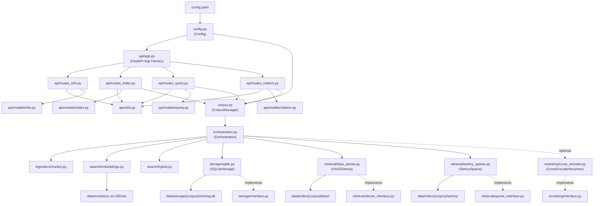
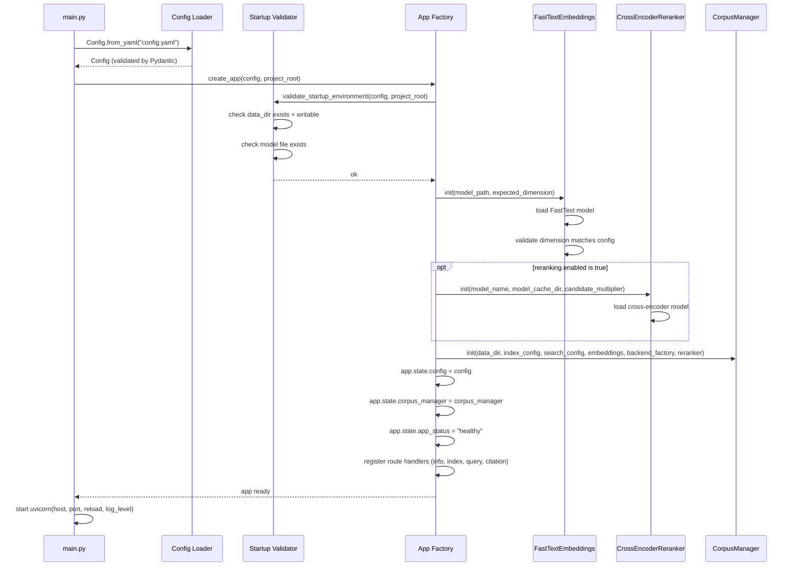
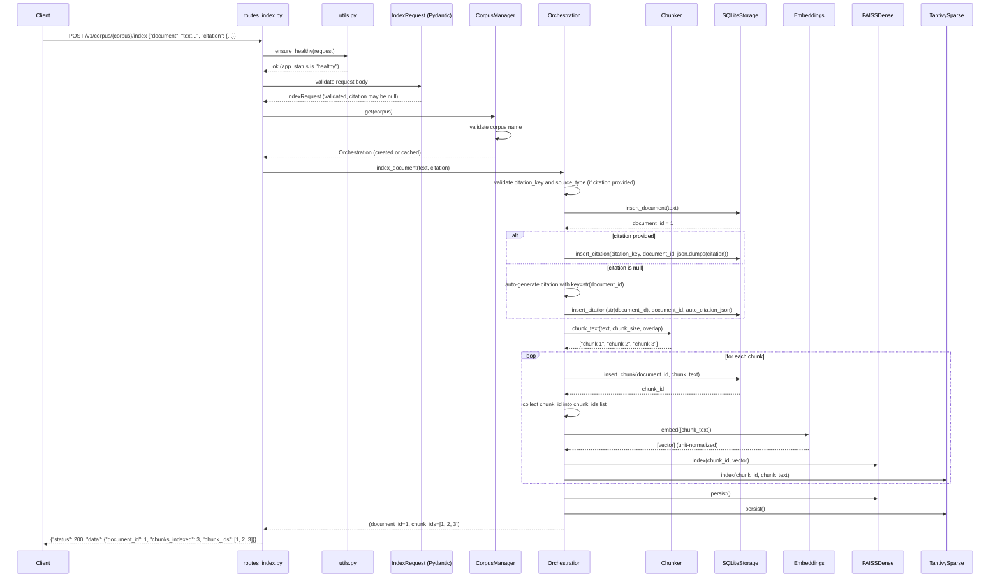
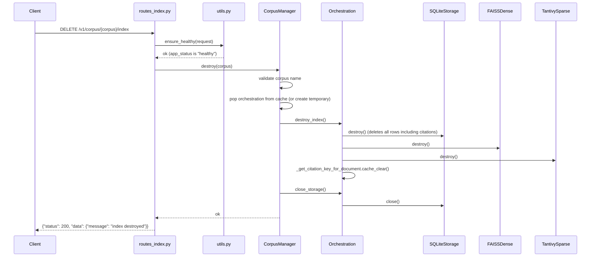
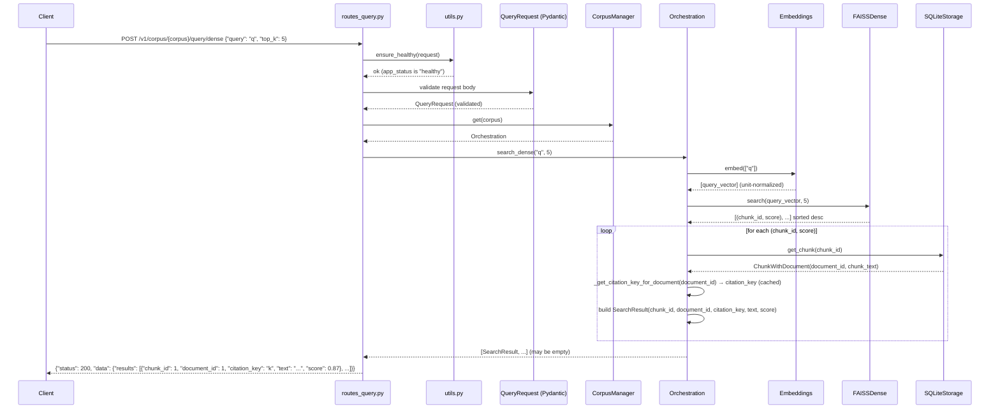
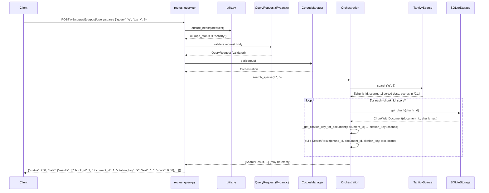
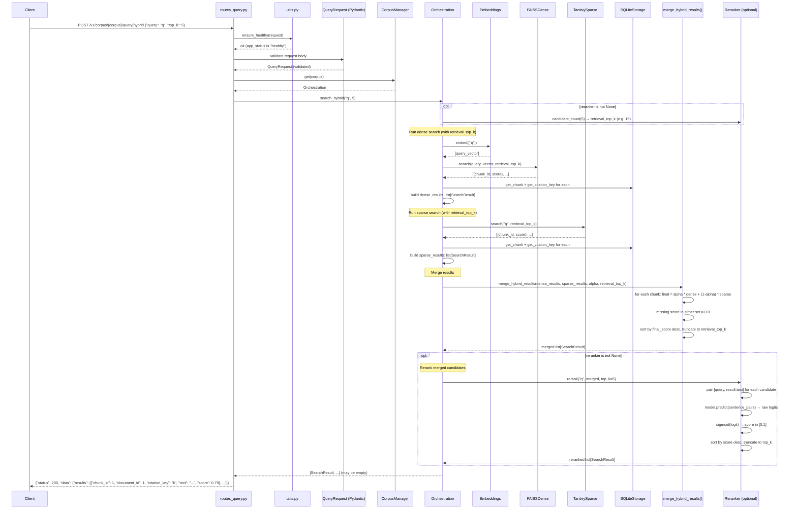
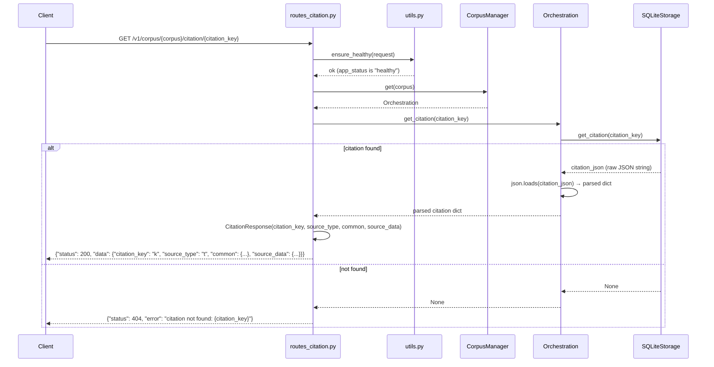
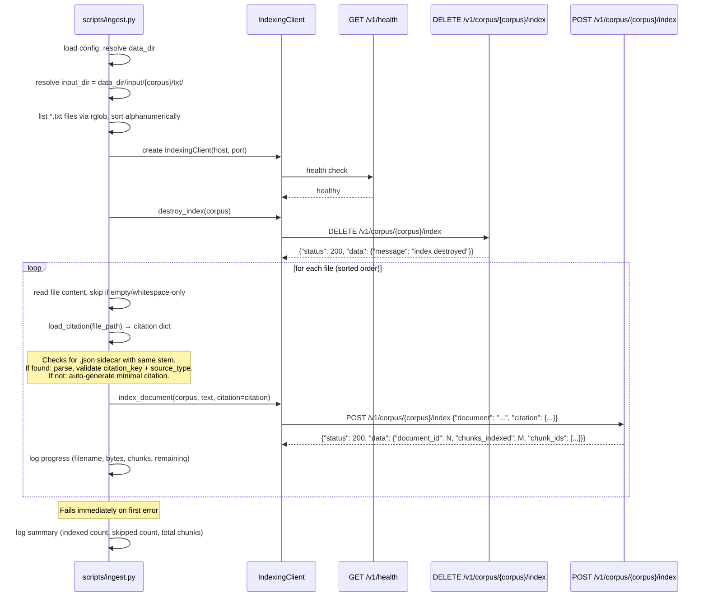
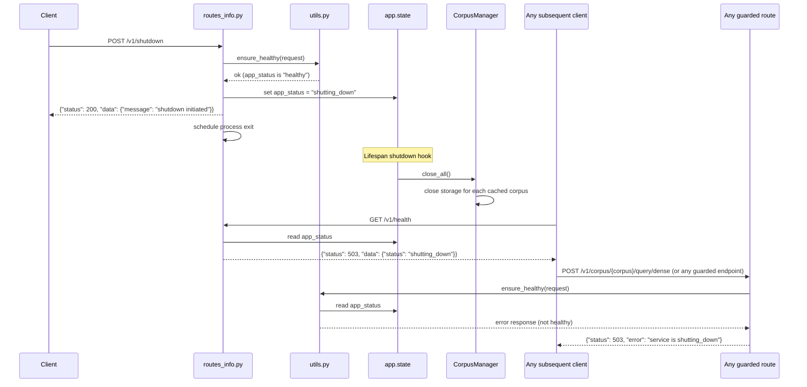

# mini-rag Data Flow Specification

**Version:** 2.0
**Status:** Draft
**Date:** 2026-02-10
**Parent document:** [SPECIFICATION.md](SPECIFICATION.md)

## 1. Scope

This document specifies the complete data flow of the mini-rag system across three levels of detail:

- **External API scope** — HTTP request/response contracts at the service boundary.
- **Inter-component scope** — data types, method signatures, and flow between internal Python modules.
- **Sequence scope** — step-by-step ordering of operations for every use case.

All diagrams and contracts are based on `SPECIFICATION.md` v3.0.

## 2. Component Dependency Diagram

This diagram shows which component depends on which. Arrows point from dependent to dependency.



## 3. Component Hierarchy

```
Config (config.py)
└── loaded at startup, stored on app.state.config
    ├── ServiceConfig        → used by main.py (uvicorn startup)
    ├── DataConfig           → used by all components for path resolution
    ├── IndexConfig
    │   ├── ChunkingConfig   → used by Orchestration → Chunker
    │   ├── EmbeddingsConfig → used by Orchestration → Embeddings
    │   ├── StorageConfig    → used by Orchestration → SQLiteStorage
    │   ├── FAISSConfig      → used by Orchestration → FAISSDense
    │   └── TantivyConfig    → used by Orchestration → TantivySparse
    └── SearchConfig
        ├── HybridConfig       → used by Orchestration → HybridMerge
        ├── DenseSearchConfig  → reserved
        ├── SparseSearchConfig → reserved
        └── RerankingConfig    → used by App Factory → CrossEncoderReranker

CorpusManager (corpus.py)
└── stored on app.state.corpus_manager
    ├── caches per-corpus Orchestration instances
    ├── creates backends lazily via OrchestrationFactory
    └── thread-safe via threading.Lock

Orchestration (orchestration.py)
└── one instance per corpus, cached by CorpusManager
    ├── owns: SQLiteStorage instance (via Storage interface)
    ├── owns: FAISSDense instance (via DenseRetrieval interface)
    ├── owns: TantivySparse instance (via SparseRetrieval interface)
    ├── shares: Embeddings instance (across all corpora)
    ├── shares: Reranker instance (optional, across all corpora)
    ├── calls: hybrid_merge() pure function
    └── caches: citation key lookups via thread-safe dict (positive results only)

FastAPI App (api/app.py)
└── created by app factory, wires everything together
    ├── app.state.config          → Config
    ├── app.state.corpus_manager  → CorpusManager
    ├── app.state.app_status      → "healthy" | "shutting_down"
    ├── router: routes_info.py    → health, info, shutdown
    ├── router: routes_index.py   → index, destroy (corpus-scoped)
    ├── router: routes_query.py   → dense, sparse, hybrid (corpus-scoped)
    └── router: routes_citation.py → citation lookup (corpus-scoped)
```

## 4. External API Data Flow

This section documents the input/output contract at the HTTP boundary for every endpoint. All corpus-scoped endpoints use the URL pattern `/v1/corpus/{corpus}/...` where `{corpus}` must match `^[a-zA-Z][a-zA-Z0-9_-]*$`.

### 4.1 GET /v1/health

```
Request:  (no body)
Response: {"status": 200, "data": {"status": "healthy"}}
          {"status": 503, "data": {"status": "shutting_down"}}
```

Always available regardless of app state. Reads `app.state.app_status` and returns the current value. No internal component calls beyond reading the app state.

### 4.2 GET /v1/info

```
Request:  (no body)
Response: {"status": 200, "data": {"config": { ...full config via model_dump()... }}}
```

Always available regardless of app state. Calls `app.state.config.model_dump()` to serialize the entire config tree.

### 4.3 POST /v1/shutdown

```
Request:  (no body)
Response: {"status": 200, "data": {"message": "shutdown initiated"}}
```

Guarded by `ensure_healthy()`. Sets `app.state.app_status` to `"shutting_down"`, then schedules the process exit. All subsequent requests to guarded endpoints return HTTP 503.

### 4.4 POST /v1/corpus/{corpus}/index

```
Request:  {"document": "full text content...", "citation": {"citation_key": "k", "source_type": "t", "common": {}, "source_data": {}}}
Response: {"status": 200, "data": {"document_id": 1, "chunks_indexed": 5, "chunk_ids": [1, 2, 3, 4, 5]}}
Error:    {"status": 400, "error": "invalid corpus name: ..."}
          {"status": 400, "error": "document text must not be empty"}
          {"status": 422, "error": "...pydantic validation error..."}
          {"status": 500, "error": "...internal exception message..."}
          {"status": 503, "error": "service is shutting_down"}
```

Guarded by `ensure_healthy()`. Validation at API boundary (Pydantic model `IndexRequest`):

- `document` field must be present and a string.
- Empty or whitespace-only text rejected with 422.
- `citation` field is optional (`dict | None`). If omitted or null, a citation is auto-generated using the document ID.
- Extra fields forbidden (`ConfigDict(extra="forbid")`).

The route handler resolves the corpus via `corpus_manager.get(corpus)`, then calls `orchestration.index_document(text, citation)`. The `chunk_ids` field returns all chunk IDs assigned by the storage layer during indexing. `chunks_indexed` equals `len(chunk_ids)`.

### 4.5 DELETE /v1/corpus/{corpus}/index

```
Request:  (no body)
Response: {"status": 200, "data": {"message": "index destroyed"}}
Error:    {"status": 400, "error": "invalid corpus name: ..."}
          {"status": 503, "error": "service is shutting_down"}
```

Guarded by `ensure_healthy()`. Calls `corpus_manager.destroy(corpus)` which destroys the index, closes storage, and evicts from cache.

### 4.6 POST /v1/corpus/{corpus}/query/dense

```
Request:  {"query": "search terms", "top_k": 5}
Response: {"status": 200, "data": {"results": [
            {"chunk_id": 1, "document_id": 1, "citation_key": "key", "text": "...", "score": 0.87},
            ...
          ]}}
Empty:    {"status": 200, "data": {"results": []}}
Error:    {"status": 400, "error": "invalid corpus name: ..."}
          {"status": 400, "error": "query must not be empty"}
          {"status": 503, "error": "service is shutting_down"}
```

Guarded by `ensure_healthy()`.

Validation at API boundary (Pydantic model `QueryRequest`):

- `query` must be a non-empty string.
- `top_k` must be a positive integer.

Each result includes `chunk_id`, `document_id`, `citation_key`, `text`, and `score`. Scores are cosine similarities in [0, 1]. An empty results list is returned when no matches are found or when the index is empty — this is not an error.

### 4.7 POST /v1/corpus/{corpus}/query/sparse

Same request/response format as dense. Guarded by `ensure_healthy()`. Scores are BM25 scores normalized to [0, 1].

### 4.8 POST /v1/corpus/{corpus}/query/hybrid

Same request/response format as dense. Guarded by `ensure_healthy()`. Scores are alpha-weighted combination of dense and sparse scores, optionally reranked by a cross-encoder model (when `search.reranking.enabled: true`). When reranked, scores are sigmoid-normalized cross-encoder logits in [0, 1].

### 4.9 GET /v1/corpus/{corpus}/citation/{citation_key}

```
Request:  (no body)
Response: {"status": 200, "data": {"citation_key": "k", "source_type": "t", "common": {...}, "source_data": {...}}}
Error:    {"status": 400, "error": "invalid corpus name: ..."}
          {"status": 404, "error": "citation not found: unknown_key"}
          {"status": 503, "error": "service is shutting_down"}
```

Guarded by `ensure_healthy()`. The route handler resolves the corpus via `corpus_manager.get(corpus)`, calls `orchestration.get_citation(citation_key)` which returns a parsed citation dict (or None), and constructs a `CitationResponse` model from it.

## 5. Inter-Component Data Flow

This section specifies the exact data types passed between components at every internal boundary.

### 5.1 Route Handlers → CorpusManager → Orchestration

Route handlers access orchestration via the `CorpusManager` stored on `app.state.corpus_manager`. The corpus name is extracted from the URL path parameter.

```python
corpus_manager = get_corpus_manager(request)               # reads app.state.corpus_manager
orchestration = await asyncio.to_thread(corpus_manager.get, corpus)  # lazy creation + caching
```

| Route method call | Input types | Return type |
|---|---|---|
| `orchestration.index_document(text, citation)` | `text: str, citation: dict[str, object] \| None` | `tuple[int, list[int]]` — (document_id, chunk_ids) |
| `orchestration.destroy_index()` | (none) | `None` |
| `orchestration.search_dense(query, top_k)` | `query: str, top_k: int` | `list[SearchResult]` |
| `orchestration.search_sparse(query, top_k)` | `query: str, top_k: int` | `list[SearchResult]` |
| `orchestration.search_hybrid(query, top_k)` | `query: str, top_k: int` | `list[SearchResult]` |
| `orchestration.get_citation(citation_key)` | `citation_key: str` | `dict[str, object] \| None` — parsed citation dict or None |

For `destroy_index`, the route handler calls `corpus_manager.destroy(corpus)` instead of the orchestration method directly. This destroys the index, closes storage, and evicts the cache entry.

Exceptions: `ValueError` from corpus name validation (→ HTTP 400), `ValueError` from input validation (→ HTTP 400), `RuntimeError` from indexing failures (→ HTTP 500), unhandled exceptions (→ HTTP 500).

### 5.2 Orchestration → Chunker

```python
chunks: list[str] = chunk_text(
    text: str,
    chunk_size: int,       # from index.chunking.chunk_size
    overlap: float         # from index.chunking.overlap
)
```

- Input: raw document text and chunking parameters from config.
- Output: ordered list of chunk strings.
- Errors: `ValueError` for empty text, invalid parameters, or non-positive step.

### 5.3 Orchestration → Embeddings

```python
vectors: list[list[float]] = embeddings.embed(texts: list[str])
```

- Input: list of text strings (chunks for indexing, or single query for search).
- Output: list of float vectors, each of length `index.embeddings.dimension` (300), unit-normalized.
- Errors: model load failure, inference failure, dimension mismatch (validated at load time).

### 5.4 Orchestration → Storage (SQLiteStorage)

| Method | Input | Output |
|---|---|---|
| `insert_document(content: str)` | document text | `int` — document_id (autoincrement) |
| `insert_chunk(document_id: int, content: str)` | parent document ID, chunk text | `int` — chunk_id (autoincrement) |
| `insert_citation(citation_key: str, document_id: int, citation_json: str)` | citation key, document ID, JSON string | `None` — fails on duplicate key |
| `get_document(document_id: int)` | document ID | `str` — document content |
| `get_chunk(chunk_id: int)` | chunk ID | `ChunkWithDocument(document_id, content)` — named tuple |
| `get_citation_key(document_id: int)` | document ID | `str \| None` — citation key or None |
| `get_citation(citation_key: str)` | citation key | `str \| None` — raw JSON string or None |
| `list_chunks(document_id: int)` | document ID | `list[ChunkRecord]` — list of (chunk_id, content) |
| `close()` | (none) | `None` — closes database connection |
| `destroy()` | (none) | `None` — wipes all tables including citations |

All IDs are assigned by SQLite autoincrement. The storage layer does not generate or validate embeddings. Citation key uniqueness is enforced by the PRIMARY KEY constraint.

### 5.5 Orchestration → DenseRetrieval (FAISSDense)

| Method | Input | Output |
|---|---|---|
| `index(chunk_id: int, embedding: list[float])` | chunk ID + unit-normalized vector | `None` |
| `search(query_embedding: list[float], top_k: int)` | unit-normalized query vector + limit | `list[ScoredChunk]` — (chunk_id, score) sorted by score desc |
| `persist()` | (none) | `None` — flushes index to disk |
| `destroy()` | (none) | `None` — wipes FAISS index files |

Scores are inner products on unit-normalized vectors, naturally in [0, 1] (cosine similarity).

### 5.6 Orchestration → SparseRetrieval (TantivySparse)

| Method | Input | Output |
|---|---|---|
| `index(chunk_id: int, content: str)` | chunk ID + chunk text | `None` |
| `search(query: str, top_k: int)` | query string + limit | `list[ScoredChunk]` — (chunk_id, score) sorted by score desc |
| `persist()` | (none) | `None` — flushes index to disk |
| `destroy()` | (none) | `None` — wipes Tantivy index files |

Scores are BM25 relevance scores normalized to [0, 1] by dividing by the maximum score in the result set.

### 5.7 Orchestration → Hybrid Merge

```python
results: list[SearchResult] = merge_hybrid_results(
    dense_results: list[SearchResult],
    sparse_results: list[SearchResult],
    alpha: float,          # from search.hybrid.alpha
    top_k: int
)
```

- Input: two result sets (already resolved to SearchResult with document_id, citation_key, text, score), alpha weight, and limit.
- Output: merged, re-ranked list of `SearchResult` truncated to `top_k`.
- Formula: `final_score = alpha * dense_score + (1 - alpha) * sparse_score`.
- Missing score (chunk in only one set) = 0.0.
- Each SearchResult carries `chunk_id`, `document_id`, `citation_key`, `text`, and the computed `score`.

### 5.8 Orchestration → Reranker (optional)

```python
reranked: list[SearchResult] = reranker.rerank(
    query: str,
    results: list[SearchResult],
    top_k: int
)
candidate_count: int = reranker.candidate_count(top_k: int)
```

- `candidate_count(top_k)` returns `top_k * candidate_multiplier` — the number of candidates to retrieve before reranking.
- `rerank(query, results, top_k)` re-scores each result by pairing `[query, result.text]` and passing to the cross-encoder model. Raw logits are normalized via sigmoid. Results are re-sorted by score descending and truncated to `top_k`.
- Each SearchResult preserves `chunk_id`, `document_id`, `citation_key`, and `text`; only `score` changes.
- Errors: `ValueError` for empty query or non-positive top_k, `RuntimeError` for score count mismatch.

### 5.9 Orchestration: Chunk ID → SearchResult Resolution

The retrieval interfaces return `list[ScoredChunk]` (chunk_id, score). The orchestration layer resolves each chunk ID via `_resolve_results()`:

1. Call `storage.get_chunk(chunk_id)` → `ChunkWithDocument(document_id, chunk_text)`.
2. Call `_get_citation_key_for_document(document_id)` → citation_key (cached, positive results only).
3. Construct `SearchResult(chunk_id, document_id, citation_key, text, score)`.

Stale chunk IDs (not found in storage) are logged and skipped. This resolution happens before results are returned to route handlers or passed to the hybrid merge function.

### 5.10 Config → Components (Startup Wiring)

```
main.py
  │
  ├── config = Config.from_yaml("config.yaml")
  ├── validate_startup_environment(config, project_root)
  │
  └── app = create_app(config, project_root)
        │
        ├── app.state.config = config
        ├── app.state.app_status = "healthy"
        │
        ├── embeddings = FastTextEmbeddings(model_path, expected_dimension)
        │     └── loads FastText model, validates dimension
        │
        ├── reranker = CrossEncoderReranker(...) if reranking.enabled else None
        │     └── loads cross-encoder model via sentence-transformers
        │
        ├── corpus_manager = CorpusManager(
        │       data_dir, index_config, search_config,
        │       embeddings, backend_factory, reranker
        │   )
        │     └── lazy: creates per-corpus Orchestration on first access
        │
        └── app.state.corpus_manager = corpus_manager
```

Per-corpus backend creation (lazy, inside `CorpusManager._create_orchestration()`):

```
backend_factory(corpus, data_dir, index_config, search_config, embeddings, reranker)
  │
  ├── storage = SQLiteStorage(db_path=data_dir/storage/{corpus}/minirag.db)
  │     └── opens/creates SQLite database + tables
  │
  ├── dense = FAISSDense(index_dir=data_dir/index/{corpus}/faiss/)
  │     └── loads/creates FAISS index
  │
  ├── sparse = TantivySparse(index_dir=data_dir/index/{corpus}/tantivy/)
  │     └── loads/creates Tantivy index
  │
  └── Orchestration(chunking_config, embeddings, storage, dense, sparse, search_config, reranker)
```

## 6. Sequence Diagrams

### 6.1 Startup Sequence



**Note:** Per-corpus backends (Storage, FAISSDense, TantivySparse, Orchestration) are created lazily on first access via `CorpusManager.get(corpus)`, not at startup.

**Failure:** Any step that fails aborts the startup immediately. No partial initialization.

### 6.2 Index Document Sequence



**Failure:** If `ensure_healthy()` fails, returns HTTP 503. If corpus name is invalid, returns HTTP 400. If any indexing step fails, the error propagates immediately. No rollback. Partial state may remain.

### 6.3 Destroy Index Sequence



### 6.4 Dense Query Sequence



**Empty results:** If FAISS returns no matches (empty index or no similar vectors), the orchestration layer returns an empty list. The route handler wraps it as `{"results": []}` with HTTP 200. This is not an error.

### 6.5 Sparse Query Sequence



### 6.6 Hybrid Query Sequence



### 6.7 Citation Lookup Sequence



### 6.8 Ingestion Script Sequence



### 6.9 Shutdown Sequence



## 7. Failure Propagation Matrix

| Source failure | Where detected | Outbound effect |
|---|---|---|
| Missing `config.yaml` | Config loader (startup) | Process abort with `FileNotFoundError` |
| Invalid config schema | Pydantic validation (startup) | Process abort with `ValidationError` |
| Missing FastText model file | Startup validator | Process abort with `FileNotFoundError` |
| Embedding dimension mismatch | Embeddings init (startup) | Process abort with `ValueError` |
| Cross-encoder model load failure | CrossEncoderReranker init (startup) | Process abort with exception |
| Empty reranker model_name | CrossEncoderReranker init (startup) | Process abort with `ValueError` |
| Invalid corpus name | `validate_corpus_name()` in CorpusManager | HTTP 400 error envelope |
| SQLite init failure (lazy) | CorpusManager.get() → backend factory | HTTP 400/500 error envelope |
| FAISS init failure (lazy) | CorpusManager.get() → backend factory | HTTP 400/500 error envelope |
| Tantivy init failure (lazy) | CorpusManager.get() → backend factory | HTTP 400/500 error envelope |
| Malformed JSON body | FastAPI request parsing | HTTP 400 error envelope |
| Missing/invalid request fields | Pydantic request model | HTTP 422 error envelope |
| Empty document text | Pydantic field_validator (IndexRequest) | HTTP 422 error envelope |
| Extra request fields | Pydantic `ConfigDict(extra="forbid")` | HTTP 422 error envelope |
| Empty/whitespace text in chunker | Chunker `ValueError` → route handler | HTTP 500 error envelope |
| Invalid chunk parameters | Chunker `ValueError` → route handler | HTTP 500 error envelope |
| FAISS search/index failure | FAISSDense → Orchestration → route handler | HTTP 500 error envelope |
| Tantivy search/index failure | TantivySparse → Orchestration → route handler | HTTP 500 error envelope |
| SQLite read/write failure | SQLiteStorage → Orchestration → route handler | HTTP 500 error envelope |
| Embedding inference failure | Embeddings → Orchestration → route handler | HTTP 500 error envelope |
| Invalid alpha in hybrid merge | `merge_hybrid_results` `ValueError` → route handler | HTTP 500 error envelope |
| Reranker score count mismatch | CrossEncoderReranker → Orchestration → route handler | HTTP 500 error envelope (`RuntimeError`) |
| Citation missing citation_key | Orchestration `ValueError` → route handler | HTTP 400 error envelope |
| Citation missing source_type | Orchestration `ValueError` → route handler | HTTP 400 error envelope |
| Duplicate citation_key | SQLite UNIQUE constraint → Orchestration → route handler | HTTP 500 error envelope |
| Citation not found (GET) | routes_citation.py checks None return | HTTP 404 error envelope |
| Malformed citation sidecar JSON | `load_citation()` in ingest.py | Script abort with `ValueError` |
| Missing citation_key in sidecar | `load_citation()` in ingest.py | Script abort with `ValueError` |
| Missing source_type in sidecar | `load_citation()` in ingest.py | Script abort with `ValueError` |
| Stale chunk_id in storage | `_resolve_results()` in Orchestration | Logged warning, chunk skipped |
| Service in shutdown state | `ensure_healthy()` guard in `api/utils.py` | HTTP 503 error envelope: `"service is shutting_down"` |
| Service unreachable | Client health check | Client raises exception |

## 8. Data Type Definitions

### 8.1 SearchResult (search/types.py)

```python
@dataclass(frozen=True)
class SearchResult:
    chunk_id: int       # storage chunk identifier, must be > 0
    document_id: int    # parent document identifier, must be > 0
    citation_key: str   # citation key for source attribution, must not be empty
    text: str           # chunk text content, must not be empty
    score: float        # normalized relevance score in [0.0, 1.0]
```

Validation in `__post_init__`: `chunk_id > 0`, `document_id > 0`, `citation_key` non-empty after strip, `text` non-empty after strip, `score >= 0.0`, `score <= 1.0`.

### 8.2 ScoredChunk (search/types.py)

```python
class ScoredChunk(NamedTuple):
    chunk_id: int   # storage chunk identifier
    score: float    # relevance score
```

Used by `DenseRetrieval.search()` and `SparseRetrieval.search()`. The orchestration layer resolves chunk IDs to full `SearchResult` objects via `Storage.get_chunk()` and citation key lookup.

### 8.3 ChunkWithDocument (storage/interface.py)

```python
class ChunkWithDocument(NamedTuple):
    document_id: int  # owning document ID
    content: str      # chunk text content
```

Returned by `Storage.get_chunk()`. Used by the orchestration layer during result resolution.

### 8.4 Pydantic API Models (api/models/)

All models use `ConfigDict(extra="forbid")` to reject unexpected fields.

**IndexRequest** (api/models/index.py):

```python
class IndexRequest(BaseModel):
    document: str                          # must not be empty or whitespace-only
    citation: dict[str, object] | None = None  # optional citation metadata
```

**QueryRequest** (api/models/query.py):

```python
class QueryRequest(BaseModel):
    query: str     # non-empty search string
    top_k: int     # positive integer
```

**QueryResult** (api/models/query.py):

```python
class QueryResult(BaseModel):
    chunk_id: int
    document_id: int
    citation_key: str
    text: str
    score: float
```

**CitationResponse** (api/models/citation.py):

```python
class CitationResponse(BaseModel):
    citation_key: str
    source_type: str
    common: dict[str, object]
    source_data: dict[str, object]
```

### 8.5 Response Envelope and Guard Functions (api/utils.py, api/responses.py)

```python
success_response(status: int, data: dict) -> JSONResponse
# produces: {"status": <status>, "data": <data>}

error_response(status: int, message: str) -> JSONResponse
# produces: {"status": <status>, "error": <message>}

ensure_healthy(request: Request) -> JSONResponse | None
# checks request.app.state.app_status
# if "healthy": returns None (proceed normally)
# if not "healthy": returns error_response(503, "service is {app_status}")

get_corpus_manager(request: Request) -> CorpusManager
# reads request.app.state.corpus_manager
```

Route handlers call `ensure_healthy()` as their first action. If the return value is not `None`, the handler returns it immediately as the HTTP response.

### 8.6 Config Serialization

```python
config.model_dump() -> dict
# produces the full nested config as a Python dict for /v1/info
```

## 9. Boundary Validation Summary

Validation happens at explicit boundaries, never silently.

| Boundary | What is validated | Rejection behavior |
|---|---|---|
| App state guard | `app.state.app_status` is `"healthy"` | HTTP 503 error envelope |
| Corpus name validation | Name matches `^[a-zA-Z][a-zA-Z0-9_-]*$` | HTTP 400 error envelope (`ValueError`) |
| HTTP request parsing | JSON well-formedness | HTTP 400 |
| Pydantic request model | Field presence, types, constraints, no extra fields | HTTP 422 |
| Chunker input | Non-empty text, valid chunk_size, valid overlap | `ValueError` → HTTP 500 |
| Embeddings load | Model file exists, output dimension matches config | Startup abort |
| Reranker load | model_name non-empty, candidate_multiplier > 0, model loads | Startup abort |
| Retrieval interfaces | Internal consistency (chunk_id mapping, score range) | Exception → HTTP 500 |
| Hybrid merge | alpha in [0.0, 1.0], top_k > 0 | `ValueError` → HTTP 500 |
| Citation at indexing | citation_key non-empty string, source_type non-empty string | `ValueError` → HTTP 400 |
| Citation at lookup | citation_key exists in storage | HTTP 404 error envelope |
| Citation sidecar (ingest) | Valid JSON, citation_key present, source_type present | Script abort with `ValueError` |
| Config loading | All fields present, correct types, paths accessible | Startup abort |
| SearchResult construction | chunk_id > 0, document_id > 0, citation_key non-empty, text non-empty, score in [0,1] | `ValueError` (internal) |
