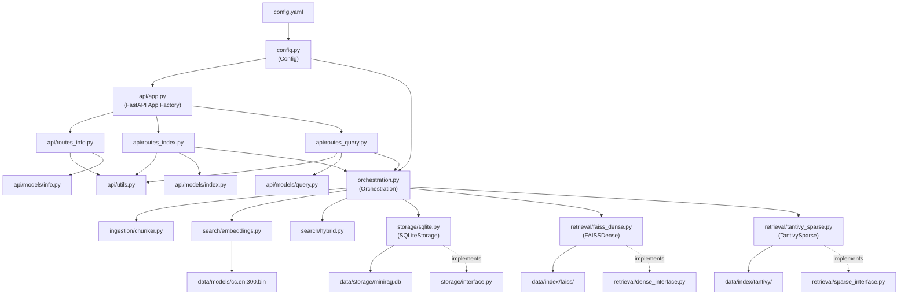
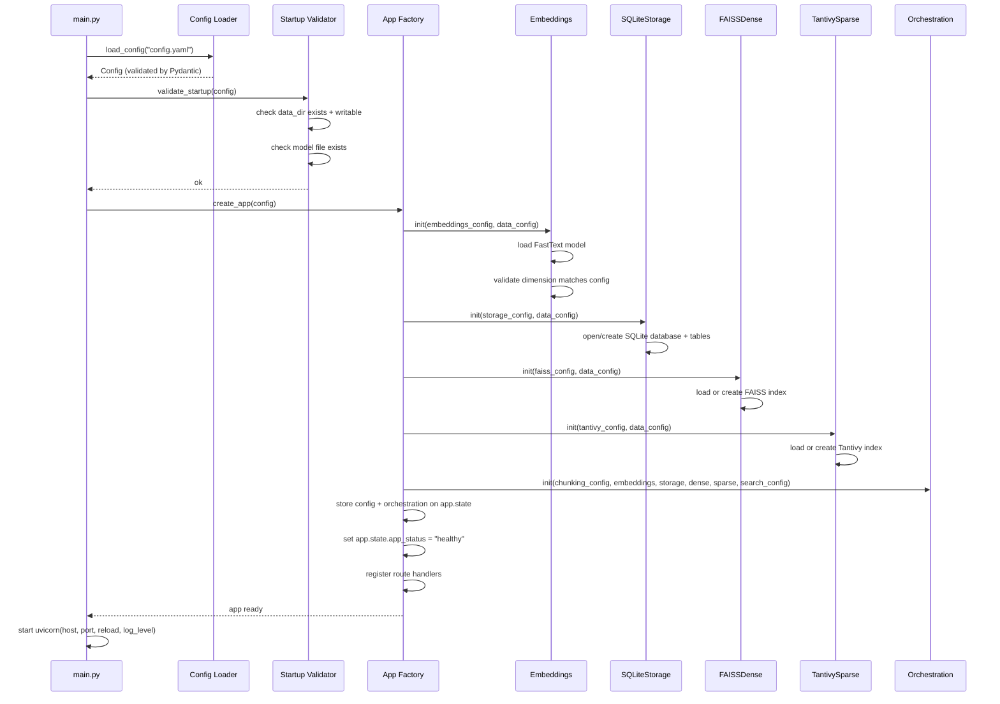
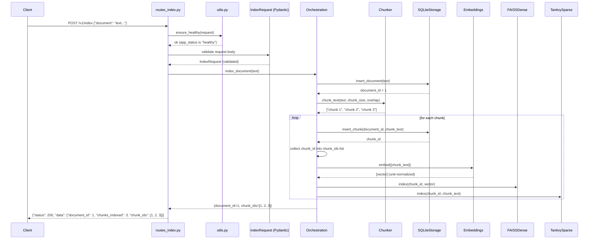
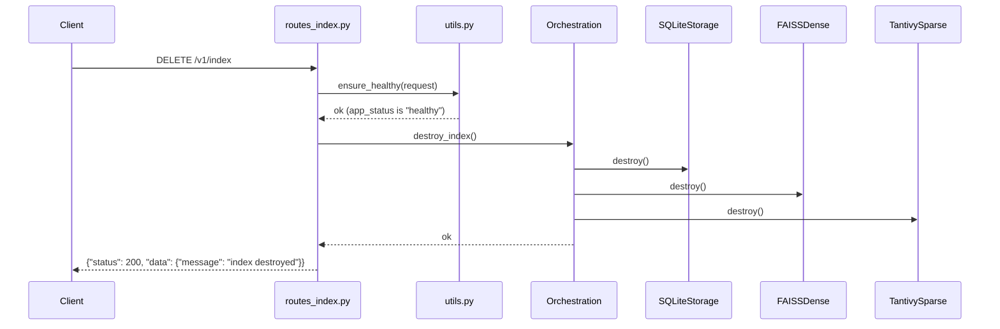
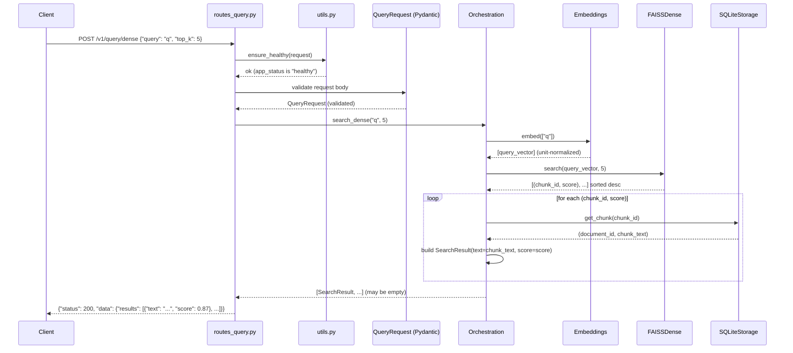
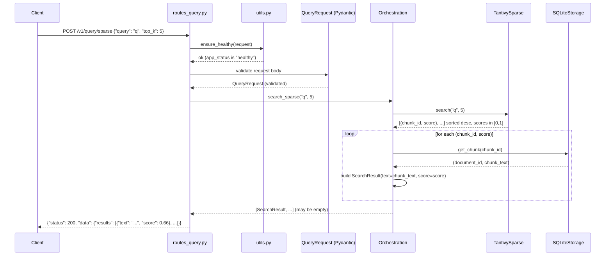
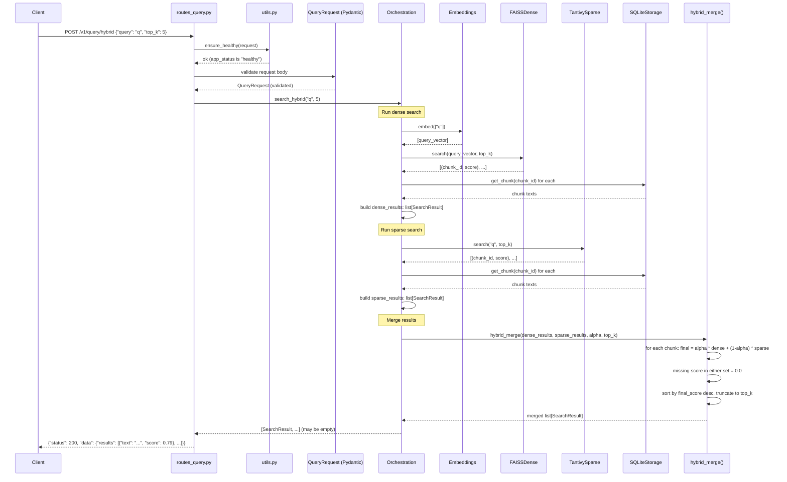
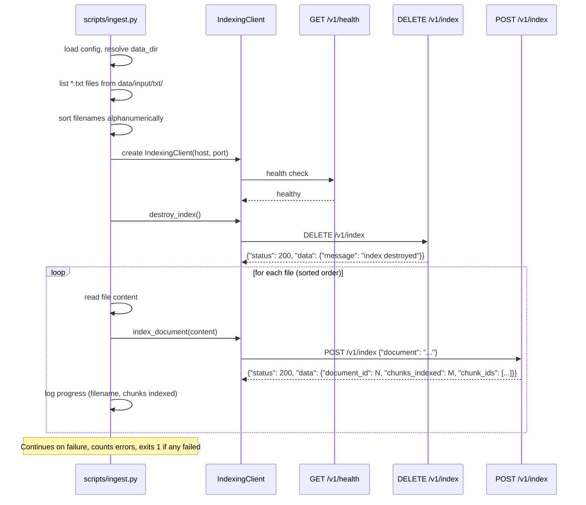
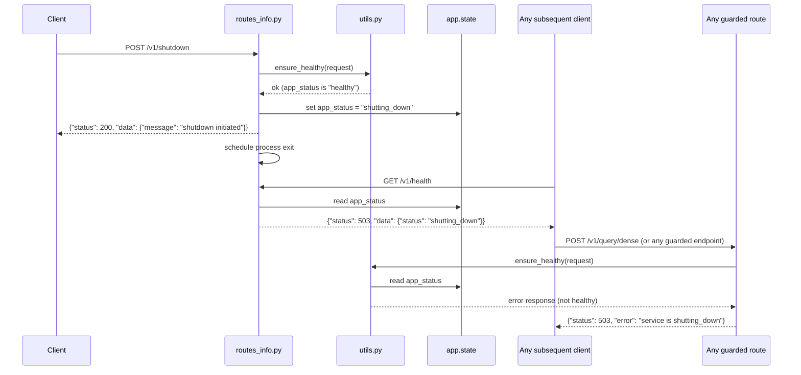

# mini-rag Data Flow Specification

**Version:** 1.0
**Status:** Draft
**Date:** 2026-02-07
**Parent document:** [SPECIFICATION.md](SPECIFICATION.md)

## 1. Scope

This document specifies the complete data flow of the mini-rag system across three levels of detail:

- **External API scope** — HTTP request/response contracts at the service boundary.
- **Inter-component scope** — data types, method signatures, and flow between internal Python modules.
- **Sequence scope** — step-by-step ordering of operations for every use case.

All diagrams and contracts are based on `SPECIFICATION.md` v2.2.

## 2. Component Dependency Diagram

This diagram shows which component depends on which. Arrows point from dependent to dependency.



## 3. Component Hierarchy

```
Config (config.py)
└── loaded at startup, stored on app.state.config
    ├── ServiceConfig      → used by main.py (uvicorn startup)
    ├── DataConfig          → used by all components for path resolution
    ├── IndexConfig
    │   ├── ChunkingConfig  → used by Orchestration → Chunker
    │   ├── EmbeddingsConfig → used by Orchestration → Embeddings
    │   ├── StorageConfig   → used by Orchestration → SQLiteStorage
    │   ├── FAISSConfig     → used by Orchestration → FAISSDense
    │   └── TantivyConfig   → used by Orchestration → TantivySparse
    └── SearchConfig
        ├── HybridConfig    → used by Orchestration → HybridMerge
        ├── DenseSearchConfig  → reserved
        └── SparseSearchConfig → reserved

Orchestration (orchestration.py)
└── stored on app.state.orchestration
    ├── owns: Chunker instance
    ├── owns: Embeddings instance
    ├── owns: SQLiteStorage instance (via Storage interface)
    ├── owns: FAISSDense instance (via DenseRetrieval interface)
    ├── owns: TantivySparse instance (via SparseRetrieval interface)
    └── calls: hybrid_merge() pure function

FastAPI App (api/app.py)
└── created by app factory, wires everything together
    ├── app.state.config         → Config
    ├── app.state.orchestration  → Orchestration
    ├── app.state.app_status     → "healthy" | "shutting_down"
    ├── router: routes_info.py  → health, info, shutdown
    ├── router: routes_index.py  → index, destroy
    └── router: routes_query.py  → dense, sparse, hybrid
```

## 4. External API Data Flow

This section documents the input/output contract at the HTTP boundary for every endpoint.

### 4.1 GET /v1/health

```
Request:  (no body)
Response: {"status": 200, "data": {"status": "healthy"}}
          {"status": 503, "data": {"status": "shutting_down"}}
```

Always available regardless of app state. Reads `app.state.app_status` and returns the current value. No internal component calls beyond reading the app state.

### 4.2 GET /v1/info

```
Request:  (no body)
Response: {"status": 200, "data": {"config": { ...full config via model_dump()... }}}
```

Always available regardless of app state. Calls `app.state.config.model_dump()` to serialize the entire config tree.

### 4.3 POST /v1/shutdown

```
Request:  (no body)
Response: {"status": 200, "data": {"message": "shutdown initiated"}}
```

Guarded by `ensure_healthy()`. Sets `app.state.app_status` to `"shutting_down"`, then schedules the process exit. All subsequent requests to guarded endpoints return HTTP 503.

### 4.4 POST /v1/index

```
Request:  {"document": "full text content..."}
Response: {"status": 200, "data": {"document_id": 1, "chunks_indexed": 5, "chunk_ids": [1, 2, 3, 4, 5]}}
Error:    {"status": 422, "error": "document text must not be empty"}
          {"status": 500, "error": "...internal exception message..."}
          {"status": 503, "error": "service is shutting_down"}
```

Guarded by `ensure_healthy()`. Validation at API boundary (Pydantic model `IndexRequest`):

- `document` field must be present and a string.
- Empty or whitespace-only text rejected with 422.

The `chunk_ids` field returns all chunk IDs assigned by the storage layer during indexing. `chunks_indexed` equals `len(chunk_ids)`.

### 4.5 DELETE /v1/index

```
Request:  (no body)
Response: {"status": 200, "data": {"message": "index destroyed"}}
Error:    {"status": 503, "error": "service is shutting_down"}
```

Guarded by `ensure_healthy()`.

### 4.6 POST /v1/query/dense

```
Request:  {"query": "search terms", "top_k": 5}
Response: {"status": 200, "data": {"results": [{"text": "...", "score": 0.87}, ...]}}
Empty:    {"status": 200, "data": {"results": []}}
Error:    {"status": 503, "error": "service is shutting_down"}
```

Guarded by `ensure_healthy()`.

Validation at API boundary (Pydantic model `QueryRequest`):

- `query` must be a non-empty string.
- `top_k` must be a positive integer.

Scores are cosine similarities in [0, 1]. An empty results list is returned when no matches are found or when the index is empty — this is not an error.

### 4.7 POST /v1/query/sparse

Same request/response format as dense. Guarded by `ensure_healthy()`. Scores are BM25 scores normalized to [0, 1].

### 4.8 POST /v1/query/hybrid

Same request/response format as dense. Guarded by `ensure_healthy()`. Scores are alpha-weighted combination of dense and sparse scores.

## 5. Inter-Component Data Flow

This section specifies the exact data types passed between components at every internal boundary.

### 5.1 Route Handlers → Orchestration

Route handlers access the orchestration layer via `request.app.state.orchestration`.

| Route method call | Input types | Return type |
|---|---|---|
| `orchestration.index_document(text)` | `text: str` | `tuple[int, list[int]]` — (document_id, chunk_ids) |
| `orchestration.destroy_index()` | (none) | `None` |
| `orchestration.search_dense(query, top_k)` | `query: str, top_k: int` | `list[SearchResult]` |
| `orchestration.search_sparse(query, top_k)` | `query: str, top_k: int` | `list[SearchResult]` |
| `orchestration.search_hybrid(query, top_k)` | `query: str, top_k: int` | `list[SearchResult]` |

Any exception raised in the orchestration layer propagates to the route handler, which catches it and returns an HTTP 500 error envelope with the raw exception message.

### 5.2 Orchestration → Chunker

```python
chunks: list[str] = chunk_text(
    document_text: str,
    chunk_size: int,       # from index.chunking.chunk_size
    overlap: float         # from index.chunking.overlap
)
```

- Input: raw document text and chunking parameters from config.
- Output: ordered list of chunk strings.
- Errors: `ValueError` for empty text, invalid parameters, or non-positive step.

### 5.3 Orchestration → Embeddings

```python
vectors: list[list[float]] = embeddings.embed(texts: list[str])
```

- Input: list of text strings (chunks for indexing, or single query for search).
- Output: list of float vectors, each of length `index.embeddings.dimension` (300), unit-normalized.
- Errors: model load failure, inference failure, dimension mismatch (validated at load time).

### 5.4 Orchestration → Storage (SQLiteStorage)

| Method | Input | Output |
|---|---|---|
| `insert_document(content: str)` | document text | `int` — document_id (autoincrement) |
| `insert_chunk(document_id: int, content: str)` | parent document ID, chunk text | `int` — chunk_id (autoincrement) |
| `get_document(document_id: int)` | document ID | `str` — document content |
| `get_chunk(chunk_id: int)` | chunk ID | `tuple[int, str]` — (document_id, chunk_content) |
| `close()` | (none) | `None` — closes database connection |
| `destroy()` | (none) | `None` — wipes all tables |

All IDs are assigned by SQLite autoincrement. The storage layer does not generate or validate embeddings.

### 5.5 Orchestration → DenseRetrieval (FAISSDense)

| Method | Input | Output |
|---|---|---|
| `index(chunk_id: int, embedding: list[float])` | chunk ID + unit-normalized vector | `None` |
| `search(query_embedding: list[float], top_k: int)` | unit-normalized query vector + limit | `list[ScoredChunk]` — (chunk_id, score) sorted by score desc |
| `persist()` | (none) | `None` — flushes index to disk |
| `destroy()` | (none) | `None` — wipes FAISS index files |

Scores are inner products on unit-normalized vectors, naturally in [0, 1] (cosine similarity).

### 5.6 Orchestration → SparseRetrieval (TantivySparse)

| Method | Input | Output |
|---|---|---|
| `index(chunk_id: int, content: str)` | chunk ID + chunk text | `None` |
| `search(query: str, top_k: int)` | query string + limit | `list[ScoredChunk]` — (chunk_id, score) sorted by score desc |
| `persist()` | (none) | `None` — flushes index to disk |
| `destroy()` | (none) | `None` — wipes Tantivy index files |

Scores are BM25 relevance scores normalized to [0, 1] by dividing by the maximum score in the result set.

### 5.7 Orchestration → Hybrid Merge

```python
results: list[SearchResult] = hybrid_merge(
    dense_results: list[SearchResult],
    sparse_results: list[SearchResult],
    alpha: float,          # from search.hybrid.alpha
    top_k: int
)
```

- Input: two result sets (already resolved to text + score by orchestration), alpha weight, and limit.
- Output: merged, re-ranked list of `SearchResult` truncated to `top_k`.
- Formula: `final_score = alpha * dense_score + (1 - alpha) * sparse_score`.
- Missing score (chunk in only one set) = 0.0.

### 5.8 Orchestration: Chunk ID → Text Resolution

The retrieval interfaces return `list[tuple[int, float]]` (chunk_id, score). The orchestration layer resolves chunk IDs to text by calling `storage.get_chunk(chunk_id)` for each result, then constructs `SearchResult(text=chunk_content, score=score)`.

This resolution step happens inside the orchestration layer before results are returned to route handlers or passed to the hybrid merge function.

### 5.9 Config → Components (Startup Wiring)

```
main.py
  │
  ├── config = load_config("config.yaml")
  ├── validate_startup(config)
  │
  └── app = create_app(config)
        │
        ├── app.state.config = config
        ├── app.state.app_status = "healthy"
        │
        ├── embeddings = Embeddings(config.get_index_config().embeddings, config.get_data_config())
        │     └── loads FastText model, validates dimension
        │
        ├── storage = SQLiteStorage(config.get_index_config().storage, config.get_data_config())
        │     └── opens/creates SQLite database
        │
        ├── dense = FAISSDense(config.get_index_config().faiss, config.get_data_config())
        │     └── loads/creates FAISS index
        │
        ├── sparse = TantivySparse(config.get_index_config().tantivy, config.get_data_config())
        │     └── loads/creates Tantivy index
        │
        └── app.state.orchestration = Orchestration(
              chunker_config=config.get_index_config().chunking,
              embeddings=embeddings,
              storage=storage,
              dense=dense,
              sparse=sparse,
              search_config=config.get_search_config()
            )
```

## 6. Sequence Diagrams

### 6.1 Startup Sequence



**Failure:** Any step that fails aborts the startup immediately. No partial initialization.

### 6.2 Index Document Sequence



**Failure:** If `ensure_healthy()` fails, returns HTTP 503 immediately. If any indexing step fails, the error propagates immediately. No rollback. Partial state may remain.

### 6.3 Destroy Index Sequence



### 6.4 Dense Query Sequence



**Empty results:** If FAISS returns no matches (empty index or no similar vectors), the orchestration layer returns an empty list. The route handler wraps it as `{"results": []}` with HTTP 200. This is not an error.

### 6.5 Sparse Query Sequence



### 6.6 Hybrid Query Sequence



### 6.7 Ingestion Script Sequence



### 6.8 Shutdown Sequence



## 7. Failure Propagation Matrix

| Source failure | Where detected | Outbound effect |
|---|---|---|
| Missing `config.yaml` | Config loader (startup) | Process abort with `FileNotFoundError` |
| Invalid config schema | Pydantic validation (startup) | Process abort with `ValidationError` |
| Missing FastText model file | Startup validator | Process abort with `FileNotFoundError` |
| Embedding dimension mismatch | Embeddings init (startup) | Process abort with `ValueError` |
| SQLite init failure | SQLiteStorage init (startup) | Process abort with exception |
| FAISS init failure | FAISSDense init (startup) | Process abort with exception |
| Tantivy init failure | TantivySparse init (startup) | Process abort with exception |
| Malformed JSON body | FastAPI request parsing | HTTP 400 error envelope |
| Missing/invalid request fields | Pydantic request model | HTTP 422 error envelope |
| Empty document text | Pydantic request model (IndexRequest) | HTTP 422 error envelope |
| Empty/whitespace text in chunker | Chunker `ValueError` → route handler | HTTP 500 error envelope |
| Invalid chunk parameters | Chunker `ValueError` → route handler | HTTP 500 error envelope |
| FAISS search/index failure | FAISSDense → Orchestration → route handler | HTTP 500 error envelope |
| Tantivy search/index failure | TantivySparse → Orchestration → route handler | HTTP 500 error envelope |
| SQLite read/write failure | SQLiteStorage → Orchestration → route handler | HTTP 500 error envelope |
| Embedding inference failure | Embeddings → Orchestration → route handler | HTTP 500 error envelope |
| Invalid alpha in hybrid merge | hybrid_merge `ValueError` → route handler | HTTP 500 error envelope |
| Service in shutdown state | `ensure_healthy()` guard in `api/utils.py` (guarded endpoints) | HTTP 503 error envelope: `"service is shutting_down"` |
| Service unreachable | Client health check | Client raises exception |

## 8. Data Type Definitions

### 8.1 SearchResult (search/types.py)

```python
@dataclass
class SearchResult:
    chunk_id: int  # storage chunk identifier
    text: str      # chunk text content
    score: float   # normalized relevance score in [0.0, 1.0]
```

### 8.2 Retrieval Interface Return Type

```python
list[ScoredChunk]  # [ScoredChunk(chunk_id, score), ...] sorted by score descending
```

`ScoredChunk` is a `NamedTuple` with fields `chunk_id: int` and `score: float`. Used by `DenseRetrieval.search()` and `SparseRetrieval.search()`. The orchestration layer resolves chunk IDs to text via `Storage.get_chunk()`.

### 8.3 Pydantic API Models (api/models/)

**IndexRequest** (api/models/index.py):

```python
class IndexRequest(BaseModel):
    document: str  # must not be empty or whitespace-only
```

**QueryRequest** (api/models/query.py):

```python
class QueryRequest(BaseModel):
    query: str     # non-empty search string
    top_k: int     # positive integer
```

### 8.4 Response Envelope and Guard Functions (api/utils.py)

```python
success_response(status: int, data: dict) -> JSONResponse
# produces: {"status": <status>, "data": <data>}

error_response(status: int, message: str) -> JSONResponse
# produces: {"status": <status>, "error": <message>}

ensure_healthy(request: Request) -> JSONResponse | None
# checks request.app.state.app_status
# if "healthy": returns None (proceed normally)
# if not "healthy": returns error_response(503, "service is {app_status}")
```

Route handlers call `ensure_healthy()` as their first action. If the return value is not `None`, the handler returns it immediately as the HTTP response.

### 8.5 Config Serialization

```python
config.model_dump() -> dict
# produces the full nested config as a Python dict for /v1/info
```

## 9. Boundary Validation Summary

Validation happens at explicit boundaries, never silently.

| Boundary | What is validated | Rejection behavior |
|---|---|---|
| App state guard | `app.state.app_status` is `"healthy"` | HTTP 503 error envelope |
| HTTP request parsing | JSON well-formedness | HTTP 400 |
| Pydantic request model | Field presence, types, constraints | HTTP 422 |
| Chunker input | Non-empty text, valid chunk_size, valid overlap | `ValueError` → HTTP 500 |
| Embeddings load | Model file exists, output dimension matches config | Startup abort |
| Retrieval interfaces | Internal consistency (chunk_id mapping, score range) | Exception → HTTP 500 |
| Hybrid merge | alpha in [0.0, 1.0], top_k > 0 | `ValueError` → HTTP 500 |
| Config loading | All fields present, correct types, paths accessible | Startup abort |
